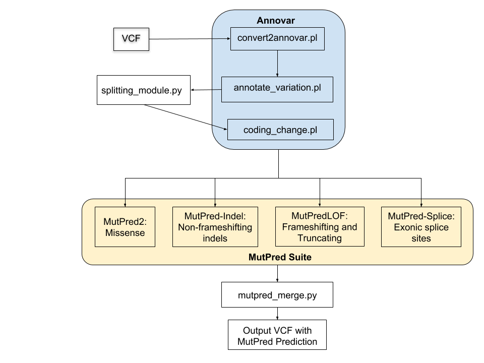

# MutPredMerge
Workflow that integrates and parallelizes use of the MutPred suite with VCF files.
## Content
[Motivation](#motivation)<br>
[Installation](#installation-and-dependencies)<br>
[Usage](#usage)<br>
[Other Resources](#resources)<br>
[Citation](#cite)


## Motivation
The [MutPred suite](http://mutpred.mutdb.org/) is a collection of machine learning tools that predict the pathogenicity of protein-coding variants to infer molecular mechanisms of disease. MutPred takes in a fasta formatted amino acid sequences as the primary input. The challenges with this input format are that isolated amino acid sequences cannot be easily assigned to genomic locations and the genomics community (including clinical genomics) works in the chromosomal space and uses VCF ([Varant Call Format](https://en.wikipedia.org/wiki/Variant_Call_Format)) as their primary file format. 

The MutPred suite offers several advantages over other functional prediction methods:
* Tools in the MutPred suite have been shown to be among the top-performing methods in independent assessments and community-wide experiments
* Apart from general pathogenicity scores, the MutPred tools return a ranked list of putative molecular mechanisms, thus generating hypotheses for further experimental follow-up.

Hence, if MutPred were to ingest a VCF containing DNA sequence variants and perform its calculations on those variants that map to conincal forms of conceptually translated amino acid sequences, then MutPred's acceptance and use would increase in the genomics community to ultimately aid in clinical DNA sequence analaysis. In particular MutPred's prediction capabiliies could improve the annotation of variants of uncertain significance.

The above goal can be acheived through a scalable integrated workflow that combines genomic tools designed to annoate data sotred in VCF files with tools in the MutPred Suite. In terms of performance, this workflow should be to analyze VCF files containing an order of 100,000 variants in a few hours and be extensible with respect to VCF annoation. Becuase MutPred tools operation on idividual amino acid sequences, and in some cases subsquences, scalablity can beacheived through standard parallelization using multiple computer nodes within a cluster. Making such a system portable for wide use is enabled by employing a standardized worflow system and containerizing tools that have complex installation requirements.  

**Workflow** 
* [Link](https://docs.google.com/drawings/d/1K82kxgp6OYccRhUak_vzbA3sk6ERMYB-eNRHvFq8JGo/edit?usp=sharing) to Workflow

## Future Directions

* Implement support for other annotation tools - SNPeff, VARANT, OpenCRAVAT 
* Think about containerization and accessibility to users
* Scale up to cloud and HPC environments

# Installation and Dependencies
<a href="#installation"></a>
## Snakemake
* Snakemake: Current conda installation of Snakemake has datrie dependency failure:
See bug:
(1) https://bitbucket.org/snakemake/snakemake/issues/934/installation-failed-in-python-37 and 
(2) https://github.com/pytries/datrie/issues/52 

Update datrie dependency first. 
``` 
wget https://github.com/pytries/datrie/archive/0.7.1.tar.gz
tar xf 0.7.1.tar.gz
cd datrie-0.7.1
./update_c.sh 
python3.7 setup.py build
python3.7 setup.py install  
```

Normal conda [installation](https://snakemake.readthedocs.io/en/stable/getting_started/installation.html) of Snakemake should work after this.
```
conda install -c bioconda -c conda-forge snakemake
```

## MutPred Suite

To install the MutPred Suite, run the install bash script in the main directory. **Beware**, the full MutPred suite, when unzipped, takes 90 Gb to store.
```
bash install.sh
```
 If you would like to install the different tools yourself, you can download them here:

[MutPred2](http://mutpred.mutdb.org/#dload)

[MutPredLOF](http://mutpredlof.cs.indiana.edu/#dload)

[MutPred-Indel](http://mutpredindel.cs.indiana.edu/#dload)

Put them into the [tools](/tools) directory and use *tar -xvzf* to unzip the tarballs. 

## Annovar
Do to licensing issues, we can't include Annovar in the source code. Go to [Annovar](http://annovar.openbioinformatics.org/en/latest/user-guide/download/) and fill out the form to receive a link to download the tool. Add the package to the [tools](/tools) folder.

Go to the main [annovar directory](/tools/annovar/) and run the command:
```
perl annotate_variation.pl -downdb -buildver hg19 -webfrom annovar refGene humandb/
```
This will download the necessary dependency files for this pipeline.

# Usage
<a href="#usage"></a>
## Running MutPredMerge
To use the pipeline, edit the top three variables in the Snakefile:
```
MAIN_DIR = "/path/to/MutPredMerge/"
VCFFILE = "/path/to/example.vcf" # your target VCF file
BASE    = "example"
```
Make sure the BASE variable is the same as the vcf filename without the ".vcf"

To run the pipleline type
```
snakemake
```
Depending on your computational resources, each variant can take 2 minutes or more to score. If you have many variants, we recommend you run the pipeline in the background.
```
nohup snakemake &
```
## Output
The pipeline outputs a copy of the input vcf file ("example.vcf") that has the scored variants annotated in [data/example.vcf.tmp](data/example.vcf.tmp). The unscored variants are ignored and no changes are made, but the scored variants will have six new variable values in the INFO section.
```
INFO=<ID=MPMANN,Number=1,Type=String,Description="Annotation from ANNOVAR in the transcript and protein space">
INFO=<ID=MPMTOOL,Number=1,Type=String,Description="Name of software run from MutPred suite: MP2 for MutPred2 (missense), MPL for MutPred-LOF (loss-of-function) and MPI for MutPred-Indel (non-frameshifting indels)">
INFO=<ID=MPMSCORE,Number=1,Type=Float,Description="General (pathogenicity) prediction score">
INFO=<ID=MPMMECH,Number=.,Type=String,Description="Predicted molecular mechanisms that meet software threshold">
INFO=<ID=MPMPROB,Number=.,Type=Float,Description="Posterior probability for each molecular mechanism">
INFO=<ID=MPMPVAL,Number=.,Type=Float,Description="P-value for each molecular mechanism">
```
#### Example Annotated Variant
```
#CHROM	POS	ID	REF	ALT	QUAL	FILTER	INFO	FORMAT
chr1	877831	.	T	C	1485.12	PASS	AB=0;ABP=0;AC=4;ADP=45;AF=1;AN=4;AO=48;CIGAR=1X;DP=49;DPB=49;DPRA=0;EPP=11.8771;EPPR=0;GTI=0;HET=0;HOM=1;LEN=1;MEANALT=2;MQM=60;MQMR=0;NC=0;NS=1;NUMALT=1;ODDS=70.0487;PAIRED=1;PAIREDR=0;PAO=0;PQA=0;PQR=0;PRO=0;QA=1694;QR=0;RO=0;RPL=25;RPP=3.19126;RPPR=0;RPR=23;RUN=1;SAF=20;SAP=5.9056;SAR=28;SF=0,1;SRF=0;SRP=0;SRR=0;TYPE=snp;WT=0;MPMANN=line1855|NM_152486|c.T1027C;MPMTOOL=MP2;MPMSCORE=0.078;MPMMECH=Gain_of_Intrinsic_disorder,Altered_MoRF,Gain_of_Helix;MPMPROB=0.51,0.30,0.27;MPMPVAL=1.5e-03,0.02,0.05	GT:ADF:RO:PVAL:GL:GQ:RD:RBQ:SDP:QA:RDR:RDF:ABQ:AO:AD:DP:QR:ADR:FREQ
```

## Resources
[Slides](https://docs.google.com/presentation/d/1Fp9yuV2slaYAni1wY5unc3VICNFA83dt0pRXeipHnmo/edit?usp=sharing)


## Cite
In Process: [Manuscript](https://docs.google.com/document/d/1vBUD3H7PPvaJc4gL45TGOKKsatZuMZtkQfMggRceGec/edit?usp=sharing)

Pejaver V, Urresti J, Lugo-Martinez J, Pagel KA, Lin GN, Nam H, Mort M, Cooper DN, Sebat J, Iakoucheva LM, Mooney SD, Radivojac P. MutPred2: inferring the molecular and phenotypic impact of amino acid variants. bioRxiv 134981; doi: https://doi.org/10.1101/134981.
